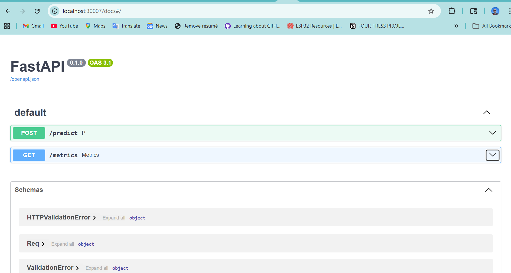
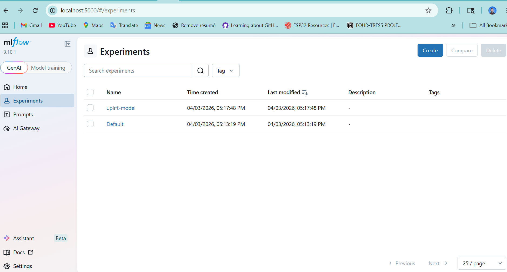
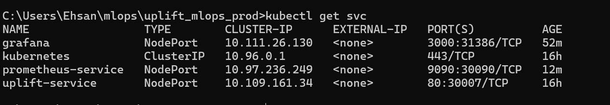
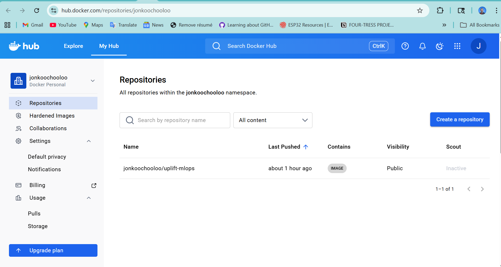
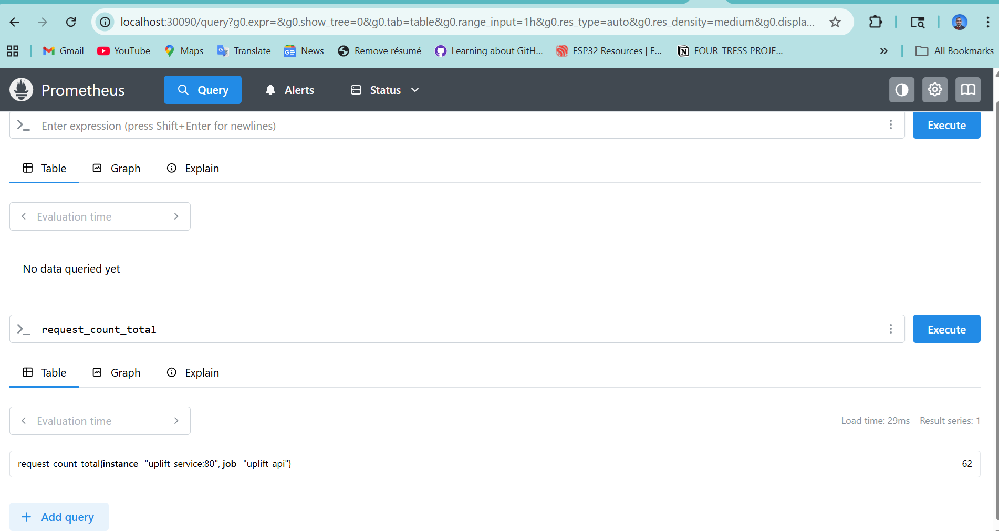
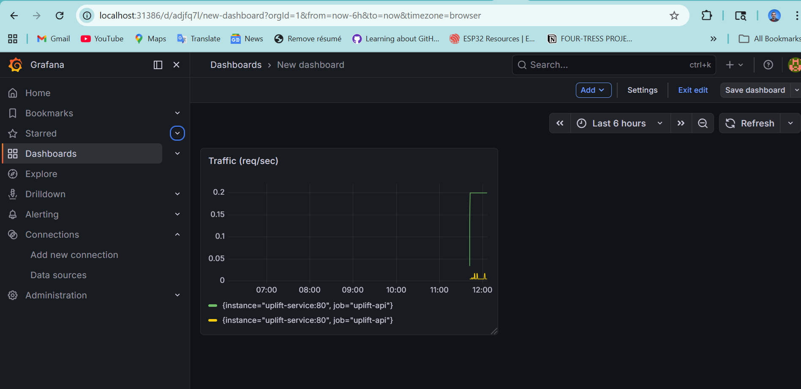
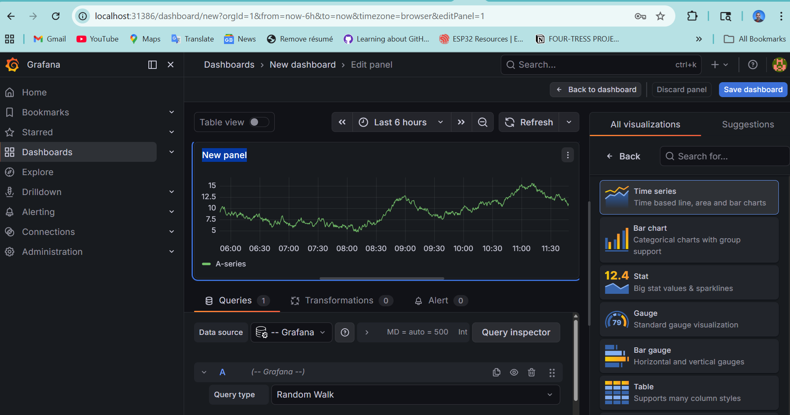

# 🚀 Uplift MLOps Pipeline

Production-style end-to-end MLOps system for uplift modeling, including model serving, containerization, Kubernetes deployment, CI/CD, and real-time monitoring with Prometheus and Grafana.

---

# 📌 Overview

This project simulates a real-world ML production system:

* FastAPI model serving (`/predict`)
* Dockerized application
* Kubernetes deployment (scalable)
* CI/CD pipeline (GitHub Actions → Docker Hub)
* Monitoring with Prometheus
* Visualization with Grafana

---
## 📊 Dataset

This project uses the **:contentReference[oaicite:0]{index=0}**, a real-world dataset designed for uplift modeling tasks in retail marketing.

### 🧠 Description
The dataset contains customer-level information including:
- `client_id` → unique customer identifier  
- `treatment_flg` → whether the customer received a marketing treatment  
- `target` → whether the customer made a purchase  
- Transactional and demographic features  

### 🎯 Objective
The goal is to estimate **incremental impact (uplift)**:
> Difference in purchase probability between treated and control groups

---

## 📊 Dataset

This project uses the **X5 RetailHero Uplift Modeling dataset** (Kaggle), a real-world dataset for evaluating marketing campaign effectiveness.

---

### 📁 Files Used

The dataset includes the following key files:

* `clients.csv` → customer-level features (demographics, behavior)
* `products.csv` → product metadata
* `uplift_train.csv` → training data with treatment and target labels
* `uplift_test.csv` → test dataset for inference
* `uplift_sample_submission.csv` → sample output format

---

### 🧠 Problem Setting

The goal is **uplift modeling**, which estimates:

> The **causal impact** of a treatment (e.g., promotion) on customer behavior

Each customer belongs to:

* **Treatment group** → received marketing action
* **Control group** → did not receive treatment

---

### 🎯 Objective

Predict the **uplift score**:

```text
Uplift = P(purchase | treatment) − P(purchase | control)
```

This allows targeting only customers who are likely to respond positively.

---

### ⚙️ How Data is Used

* `uplift_train.csv` → used to train two models:

  * Treatment model
  * Control model
* `clients.csv` → feature enrichment
* Model artifacts saved as:

  * `model_treat.pkl`
  * `model_control.pkl`

During inference:

* Input: `client_id`
* Features are reconstructed
* Both models generate probabilities
* Uplift is computed

---

### 📥 Data Access

Due to size limitations, raw data is not fully included.

Download from:
👉 https://www.kaggle.com/datasets/shonenkov/x5retailheroupliftrawdata

---

### 📁 Expected Directory Structure

```text
data/
├── clients.csv
├── products.csv
├── uplift_train.csv
├── uplift_test.csv
├── uplift_sample_submission.csv
```

---

### ⚠️ Notes

* A subset or processed version may be included for testing
* Full dataset is required for training pipeline reproduction


# 🧠 Model

* Uplift modeling using two models:

  * Treatment model
  * Control model
* Output:

```json
{
  "uplift": 0.019
}
```

---

# 📁 Project Structure

```
uplift-mlops/
│
├── api/                # FastAPI app
├── src/                # Prediction logic
├── data/               # Sample data
├── k8s/                # Kubernetes configs
├── .github/workflows/  # CI/CD pipeline
├── Dockerfile
├── requirements.txt
├── README.md
└── monitoring/
    └── dashboard.json
```

---

# ⚙️ 1. LOCAL SETUP

## Install dependencies

```bash
pip install -r requirements.txt
```

## Run API locally

```bash
uvicorn api.main:app --reload
```

## Test API

```bash
curl -X POST http://localhost:8000/predict \
-H "Content-Type: application/json" \
-d '{"client_id": 123}'
```

---

# 🐳 2. DOCKER SETUP

## Build image

```bash
docker build -t uplift-mlops .
```

## Run container

```bash
docker run -p 8000:8000 uplift-mlops
```

## Test

Open:

```
http://localhost:8000/docs
```

---

# ☸️ 3. KUBERNETES DEPLOYMENT

## Enable Kubernetes (Docker Desktop)

Settings → Kubernetes → Enable

---

## Apply deployment

```bash
kubectl apply -f k8s/
```

---

## Check pods

```bash
kubectl get pods
```

Expected:

```
uplift-api-xxxx   Running
```

---

## Check service

```bash
kubectl get svc
```

Example:

```
uplift-service   NodePort   30007
```

---

## Access API

```
http://localhost:30007/docs
```

---

# 🔄 4. CI/CD PIPELINE

## Workflow file

```
.github/workflows/deploy.yml
```

## What it does:

* Build Docker image
* Push to Docker Hub
* (Optional) Deploy to Kubernetes

---

## Required GitHub Secrets

Go to:
Settings → Secrets → Actions

Add:

```
DOCKER_USERNAME = your_dockerhub_username
DOCKER_PASSWORD = your_dockerhub_password_or_token
```

---

## Trigger pipeline

```bash
git add .
git commit -m "trigger pipeline"
git push
```

Check:
GitHub → Actions tab

---

# 📊 5. PROMETHEUS SETUP

## Run Prometheus

```bash
kubectl create deployment prometheus --image=prom/prometheus
kubectl expose deployment prometheus --type=NodePort --port=9090
```

---

## Access Prometheus

```bash
kubectl port-forward deployment/prometheus 9090:9090
```

Open:

```
http://localhost:9090
```

---

## Verify metrics

Query:

```
request_count_total
```

---

# 📈 6. GRAFANA SETUP

## Run Grafana

```bash
kubectl create deployment grafana --image=grafana/grafana
kubectl expose deployment grafana --type=NodePort --port=3000
```

---

## Access Grafana

```bash
kubectl port-forward deployment/grafana 3000:3000
```

Open:

```
http://localhost:3000
```

Login:

```
admin / admin
```

---

## Add Prometheus data source

URL:

```
http://prometheus:9090
```

---

# 📊 7. DASHBOARD QUERIES

## Traffic

```
rate(request_count_total[1m])
```

## Latency (p95)

```
histogram_quantile(0.95, rate(request_latency_seconds_bucket[1m]))
```

## CPU

```
process_cpu_seconds_total
```

## Memory

```
process_resident_memory_bytes
```

---

# 🧪 8. VALIDATION CHECKLIST

## API

```bash
curl http://localhost:30007/predict
```

✔ returns JSON

---

## Pods

```bash
kubectl get pods
```

✔ all Running

---

## Metrics

```bash
curl http://localhost:30007/metrics
```

✔ Prometheus metrics visible

---

## Prometheus

Query:

```
request_count_total
```

✔ returns data

---

## Grafana

✔ dashboards show live data

---

# ⚠️ TROUBLESHOOTING

## ❌ ErrImagePull

Fix:

* Push image to Docker Hub
* Update image name in k8s

---

## ❌ 422 error

Fix:

* client_id must be integer

---

## ❌ No metrics

Fix:

* ensure `/metrics` endpoint exists

---

## ❌ Grafana cannot connect

Fix:

* use correct service name:

```
http://prometheus-service:9090
```

---
# 📸 Screenshots

## 🚀 API (FastAPI Swagger)
<p align="center">
  
</p>

## 🚀 mlflow
<p align="center">
  
</p>


## ☸️ Kubernetes Deployment
<p align="center">
  
</p>
## ☸️ hub.docker
<p align="center">
  
</p>


## 📊 Prometheus Metrics
<p align="center">
  
</p>

## 📈 Grafana Dashboard
<p align="center">
  
</p>
<p align="center">
  
</p>

## ❌ Large file push error

Fix:

```bash
git rm --cached data/*.csv
```

---

# 🧭 ARCHITECTURE

```
Client → FastAPI → Model
         ↓
    Prometheus → Grafana
         ↓
     Kubernetes
```

---

# 💼 SKILLS DEMONSTRATED

* MLOps system design
* Kubernetes deployment
* CI/CD automation
* Monitoring & observability
* API development

---

# 📌 SUMMARY

This project demonstrates how to take an ML model from development to a fully deployed, monitored, and automated production system.

---

# 🚀 FUTURE IMPROVEMENTS

* Auto-deploy to Kubernetes in CI/CD
* Alerting (Grafana alerts)
* Logging system (ELK stack)
* Model versioning (MLflow)

---
